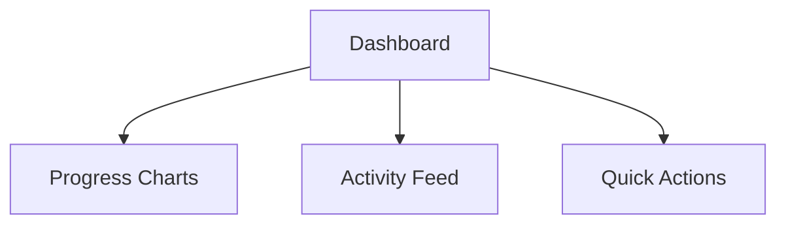
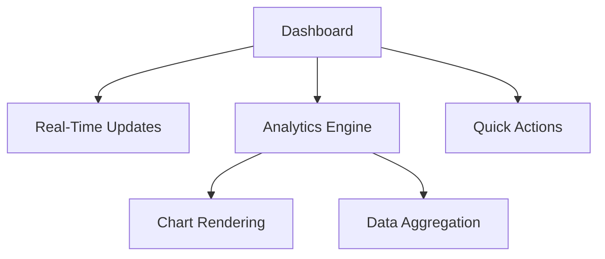

# Component Catalog 🧩

## 🖥️ Dashboard Hub
**What It Does:** Your project's mission control  
**Key Parts:**

| Element               | Purpose                          | Tech Used       |
|-----------------------|----------------------------------|-----------------|
| Smart Charts          | Visual progress tracking         | 📊 Recharts    |
| Live Updates          | Real-time team activity          | ⚡ WebSockets  |

## Dashboard
- **Description**: The main dashboard displaying an overview of tasks, analytics, and activity feed.
- **Key Components**:
  - `Chart`: Displays various analytics charts.
  - `ActivityFeed`: Shows recent activities and updates.
  - `PrioritizedTaskList`: Lists tasks based on priority.

## Sidebar
- **Description**: The navigation sidebar for accessing different sections of the application.
- **Key Components**:
  - `NavLink`: Renders individual navigation links.
  - `UserAvatar`: Displays the user's avatar and profile information.

## TaskDetails
- **Description**: Detailed view of a single task, including description, comments, and attachments.
- **Key Components**:
  - `CollaborativeEditor`: Rich text editor for task descriptions with real-time collaboration.
  - `TextSummarizer`: AI-based text summarization for long descriptions.
  - `GitReferences`: Links to GitHub/GitLab references related to the task.

## Reports
- **Description**: Page for generating and managing reports.
- **Key Components**:
  - `ReportManager`: Interface for generating and scheduling reports.

## ProjectTimeline
- **Description**: View and manage project timelines, including task dependencies and critical path analysis.
- **Key Components**:
  - `GanttChart`: Displays the project timeline as a Gantt chart.
  - `CriticalPathInfo`: Shows critical path information and high-risk tasks.
  - `TaskDependenciesPanel`: Manages task dependencies.

# Component Architecture 🧩

## 🖥️ Dashboard System

### Key Components
| Component           | Responsibility              | Tech Stack       | Performance Budget |
|---------------------|-----------------------------|------------------|---------------------|
| `LiveActivityFeed`  | Real-time updates display   | WebSockets, Redux| <200ms render       |
| `SmartChart`        | Data visualization          | Recharts, D3     | <500ms load         |
| `TaskQuickCreate`   | Rapid task entry            | Formik, Yup      | <100ms interaction  |