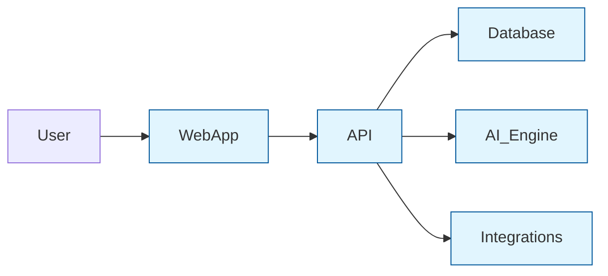
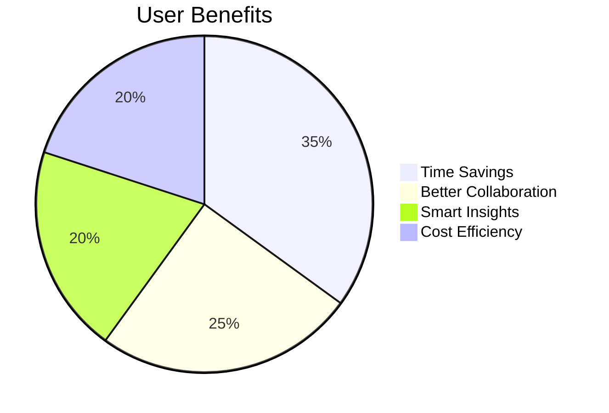

# Project Overview 🏗️

## 📌 Problem Statement
Modern teams struggle with:
- Disjointed task management across multiple tools
- Limited visibility into team workloads
- Manual progress tracking and reporting
- High costs for enterprise features

## 🎯 Solution Architecture

## 🔑 Key Differentiators
1. **Zero-Cost Enterprise Features**  
   RBAC, audit logs, and SSO included free
2. **Privacy-First Design**  
   Self-hostable with end-to-end encryption options
3. **Open Ecosystem**  
   Extensible plugin architecture for custom integrations

## 🌟 Why TaskFlow Exists?
**Problem We Solve:**  
📌 Team chaos → ✅ Organized workflows  
📌 Manual tracking → ✅ Automatic progress updates  
📌 Expensive tools → ✅ Free alternative  

🌈 **Key Benefits:**

## 🛠️ Feature Showcase
| Feature Category      | What You Get                                | User Benefit Icon |
|-----------------------|---------------------------------------------|-------------------|
| Real-Time Teamwork    | Live updates, shared editing                | 👥⏱️            |
| Smart Automation      | Automatic reminders, task sorting           | 🤖🔁            |
| Anywhere Access       | Works offline, phone/tablet ready           | 📱💾            |

## Goals
TaskFlow aims to provide a comprehensive task management platform with real-time collaboration, advanced analytics, AI-powered features, and automation, all without relying on paid services.

## Features
- **Real-Time Collaboration**: WebSocket-based real-time task updates, live activity feed, and collaborative document editing.
- **Advanced Analytics**: Task completion time tracking, workload distribution visualization, and productivity trends analysis.
- **AI-Powered Features**: Smart task prioritization, text summarization, and task effort estimation.
- **Third-Party Integrations**: GitHub/GitLab integration, CalDAV calendar synchronization, and Discord/Mattermost notifications.
- **Workflow Automation**: Rule-based task automation, scheduled tasks and reports, and email notifications.
- **Enhanced UI/UX**: Kanban board with swimlanes and WIP limits, drag-and-drop task management, interactive Gantt charts, and rich text editing.
- **Progressive Web App**: Offline functionality, push notifications, and installable on desktop and mobile devices.
- **Enterprise Features**: Role-based access control, skills-based task assignment, advanced search and filtering, and custom report generation.

## Key Functionalities
- **Task Management**: Create, update, delete, and prioritize tasks.
- **Collaboration**: Real-time updates and collaborative editing.
- **Analytics**: Visualize task and team performance metrics.
- **Automation**: Define custom automation rules and schedule reports.
- **Integrations**: Link tasks with GitHub/GitLab and synchronize with calendars.

## Target Audience
- Project managers
- Team members
- Developers
- Anyone looking for a free and comprehensive task management solution

## Project Structure
The project is structured into two main parts:
- **Frontend**: Built with React, Redux Toolkit, and Material UI.
- **Backend**: Built with Node.js, Express.js, and MongoDB.

## Diagrams
### Data Flow Diagram

### Component Interaction Diagram
