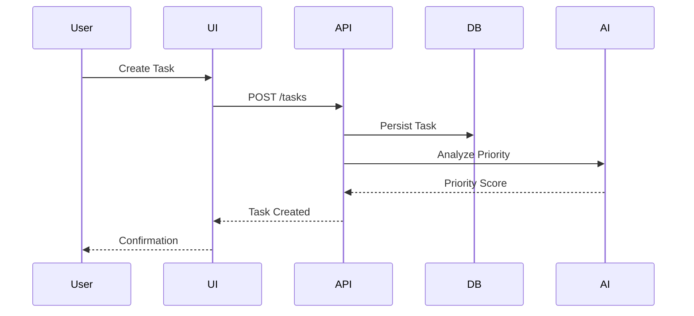

# Project Flow Structure

## Data Flow
1. **Backend API**: The backend API handles all data requests and responses, including task management, user authentication, and analytics.
2. **Redux Store**: The Redux store manages the application state, including tasks, users, and settings.
3. **Components**: React components interact with the Redux store to fetch and display data.

## Key Interactions
- **Task Creation**: 
  1. User creates a new task via the `AddTask` component.
  2. The task is sent to the backend API and stored in the database.
  3. The Redux store is updated with the new task.
  4. The `TaskList` component re-renders to display the new task.

- **Real-Time Collaboration**:
  1. Users join a collaborative session via the `CollaborativeEditor` component.
  2. Changes are broadcasted to all connected users using WebSockets.
  3. The `CollaborativeEditor` component updates the content in real-time.

- **Report Generation**:
  1. User generates a report via the `ReportManager` component.
  2. The report request is sent to the backend API.
  3. The backend generates the report and returns the file URL.
  4. The `ReportManager` component displays the download link.

# System Workflows ⚙️

## 🔄 Data Flow Diagram

## 🛡️ Security Model
| Layer        | Protection Mechanisms               | Compliance       |
|--------------|--------------------------------------|------------------|
| Frontend     | CSP, XSS Protection, Sanitization   | OWASP Top 10     |
| API          | Rate Limiting, JWT Auth             | GDPR Ready       |
| Database     | Encryption at Rest, RBAC            | SOC 2 Framework  |

<!-- ## Diagrams
### Data Flow Diagram

### Component Interaction Diagram
 -->