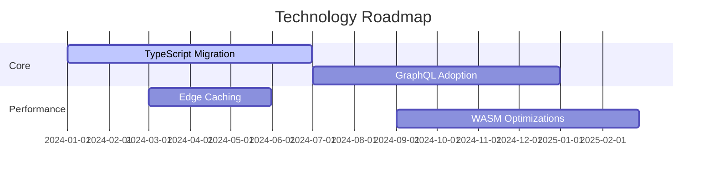

# Technology Radar 📡

## 🏗️ Core Stack
| Technology       | Version   | Purpose                          | Decision Rationale                 |
|------------------|-----------|----------------------------------|-------------------------------------|
| React            | 18.2+     | Component-based UI               | Ecosystem maturity, performance     |
| Node.js          | 20.x      | Backend runtime                  | Async I/O handling, scalability     |
| MongoDB          | 6.0+      | Document storage                 | Flexible schema, horizontal scaling |

## 🔮 Roadmap Highlights

## 🛠️ DevEx Tooling
- **Testing**: Jest, React Testing Library, Cypress
- **Linting**: ESLint + Airbnb config
- **CI/CD**: GitHub Actions with parallel jobs
- **Monitoring**: Prometheus + Grafana dashboard

# Technology Stack

## Frontend
- **React**: JavaScript library for building user interfaces.
- **Redux Toolkit**: State management library for managing application state.
- **Material UI**: React component library for building responsive user interfaces.
- **Socket.io Client**: Library for real-time communication between client and server.
- **Chart.js/Recharts**: Libraries for creating interactive charts and graphs.
- **TipTap**: Rich text editor for collaborative editing.
- **IndexedDB**: Browser database for offline storage.
- **Vite**: Build tool for faster development and production builds.

## Backend
- **Node.js**: JavaScript runtime for building server-side applications.
- **Express.js**: Web framework for building RESTful APIs.
- **MongoDB**: NoSQL database for storing application data.
- **Socket.io**: Library for real-time communication between client and server.
- **Node-cron**: Library for scheduling tasks and automation.
- **Hugging Face Models**: Pre-trained models for AI-based features like text summarization.

## Integration
- **GitHub/GitLab API**: Integration for linking tasks with code repositories.
- **CalDAV/Nextcloud**: Calendar synchronization for task deadlines.
- **Discord/Mattermost**: Notifications for team communication.